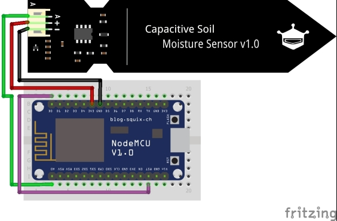
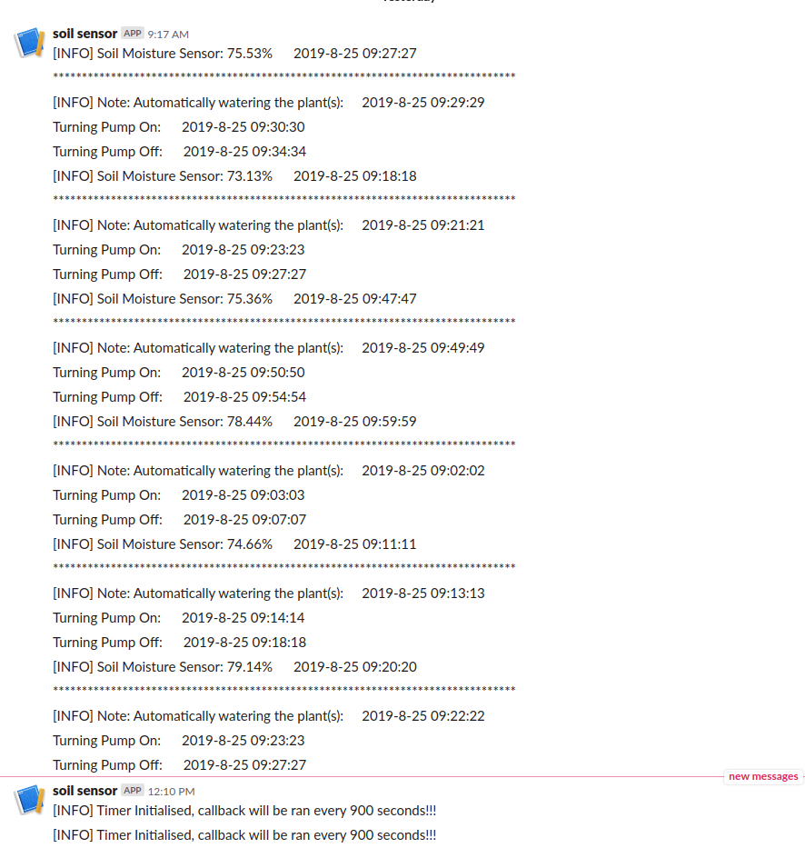
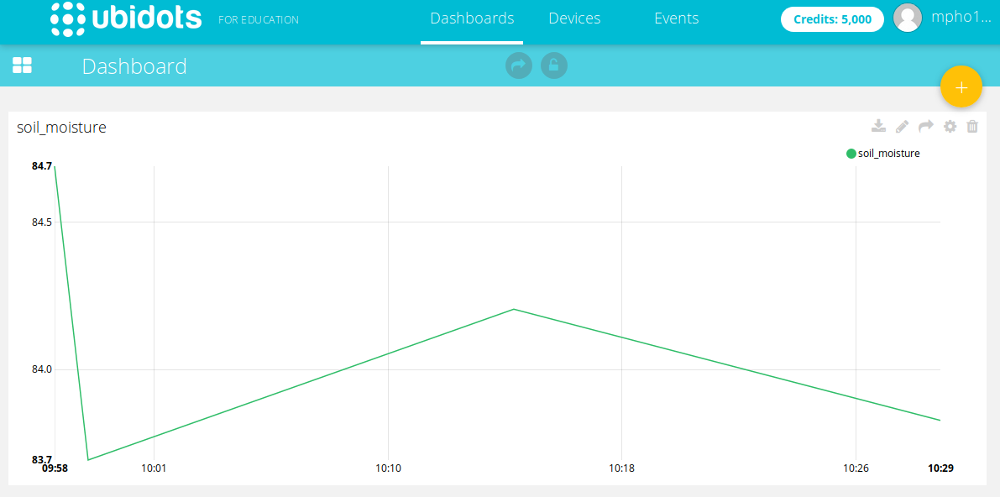

# uPython based Plant Irrigation System

[](https://github.com/psf/black)

[](https://www.codacy.com/app/mmphego/uPython-Plant-Irrigation-System?utm_source=github.com&amp;utm_medium=referral&amp;utm_content=mmphego/uPython-Plant-Irrigation-System&amp;utm_campaign=Badge_Grade)
[](http://www.micropython.org/download)
[](https://saythanks.io/to/mmphego)
[](https://paypal.me/mmphego)

**uPython based plant irrigation system running on an ESP8266**

## Story

Indoor plants can give fresh life to the room, boost oxygen in an area that can boost productivity and inspire everyone. However, due to the job often needed, they are not only substituted by artificial, counterfeit crops which are tossed into sites sometime in their lives. They do not give as much benefit as true crops. The younger generation is often seen as having a pet because of the responsibilities, and although the plants can make the most of the rooms, they're often forgotten.

Whether it is too hot, cold, dry or humid, it is very essential to regulate water levels reached by the crops. Watering crops constitute the most significant cultural practice and can be the most labor intensive or tedious job.

So, an idea of automagic plant watering system will be effective to only water plants when they need it, this reduces the amount of time required to babysit the plant.

The method employed to monitor the soil moisture level continuously and to decide whether watering is needed or not, and how much water is needed in plant’s soil.

Essentially, the system is designed and programmed to monitor humidity in the soil at specific times. Where the moisture level exceeds the set threshold value, a water pump is triggered and the required quantity of water will be provided until the threshold value is predetermined.

The automagic plant watering system runs on a [Wemos D1 esp8266](https://www.wemos.cc/) running ~Arduino~ [uPython](http://www.micropython.org/), a capacitive soil moisture sensor reads the moisture content in the soil and uploads the data to [ubidots](https://ubidots.com/) which is a data collection, analysis, and visualization tool. A [Slack](slack.com) message is sent to a specific channel when soil moisture reaches a threshold and a water pump  notification is sent.

> In essence this saves my plant(s) and enables me to concentrate on other boring stuffs.

## Circuit Diagram



### Parts Checklist
- [x] [Wemos D1 ESP8266](https://www.banggood.com/custlink/GGvDS2tE8I)
- [x] [Capacitive Soil Moisture Sensor](https://www.banggood.com/custlink/DKvDIM5y8T)
- [x] [Single Channel 5V Relay Module](https://www.banggood.com/custlink/vKvv9UtdLR)
- [x] [Mini Submersible Water Pump 3-6VDC](https://www.banggood.com/Mini-Micro-Submersible-Motor-Pump-Water-Pumps-DC-3-6V-100LH-Low-p-1249338.html?rmmds=home-mid-relatedViewed&ID=514182&cur_warehouse=CN&custlinkid=483151)
- [x] [Silicone Tubing Hose (Pump)](https://www.banggood.com/1m-Food-Grade-Translucent-Silicone-Tubing-Hose-With-1mm-To-8mm-Inner-Diameter-p-1377641.html?rmmds=detail-top-buytogether-auto&ID=512358&cur_warehouse=CN&custlinkid=483151)


## Setup

### Calibrating the Soil Moisture Sensor

Calibrating the sensor has two parts, the goal is to make sure sensor functions properly:
*   Connect up the soil moisture sensor and dip it in a bowl of water and take the reading.
*   Wipe the sensor, and place it on dry surface and take the reading

These readings should be entered in [config.json](config.json) file.

### Setup NodeMCU & Tools

Read the [docs](https://docs.micropython.org/en/latest/esp8266/esp8266/tutorial/intro.html)

TL;DR
*   Clone the repo and,
*   Plug in the device to your computer

**NOTE:** The installation assumes that the port name of device is `/dev/ttyUSB0` else, modify `Makefile` with port name [Hint:`$ ls /dev/tty*`].

*   Run `make all` : Bootstrap i.e erase, flash, and upload scripts

**NOTE:** This will install [`esptool`](https://github.com/espressif/esptool) and [`mpfshell`](https://github.com/wendlers/mpfshell) for communicating with ESP chips and for serial connection with MicroPython boards, Erase and flash the chip with firmware `esp8266-20190125-v1.10.bin` as well as upload the required files to the ESP.

Click [here](https://www.micropython.org/download) to get the latest uPython firmware.

### Setup config

The config file is self-explanatory, fill in the missing parts.

The config goes [here](config.json).
```json
{
    "Pin_Config":{
        "ADC_Pin": 0,
        "Water_Pump_Pin": 12
    },
    "wifi_config": {
        "ssid": "",
        "password": ""
    },
    "MQTT_config": {
        "Host": null,
    },
    "moisture_sensor_cal": {
        "dry": 841,
        "wet": 470,
        "Threshold": 80,
    },
    "water_pump_time": {
        "delay_pump_on": 3
    },
    "slack_auth": {
        "app_id": "",
        "secret_id": "",
        "token": ""
    },
    "ubidots":{
        "token": "",
        "device": ""
    }
}

```

### Setup Slack

See [post](http://bit.ly/2K46XP8) on how to send [Slack](slack.com) messages using Python.



code:
```python
class Slack:
    def __init__(self, app_id, secret_id, token):
        """
        Get an "incoming-webhook" URL from your slack account.
        @see https://api.slack.com/incoming-webhooks
        eg: https://hooks.slack.com/services/<app_id>/<secret_id>/<token>
        """
        self._url = "https://hooks.slack.com/services/%s/%s/%s" % (
            app_id,
            secret_id,
            token,
        )

    def slack_it(self, msg):
        """ Send a message to a predefined slack channel."""
        headers = {"content-type": "application/json"}
        data = '{"text":"%s"}' % msg
        resp = urequests.post(self._url, data=data, headers=headers)
        return "Message Sent" if resp.status_code == 200 else "Failed to sent message"
```

### Setup Ubidots Data Viz

Who doesn't love viz data, added [Ubidots](https://ubidots.com/) support for Viz



code:
```python
class Ubidots:
    def __init__(self, TOKEN, device_label):
        self.url = "https://things.ubidots.com/api/v1.6/devices/{}?token={}".format(
            device_label, TOKEN
        )

    def post_request(self, payload):
        """Creates the headers for the HTTP requests and Makes the HTTP requests"""
        print("[DEBUG] Uploading Payload: %s" % payload)
        assert isinstance(payload, dict)

        status = 400
        attempts = 0
        while status >= 400 and attempts <= 5:
            req = urequests.post(url=self.url, json=payload)
            status = req.status_code
            attempts += 1
            utime.sleep(1)
            print("[DEBUG] Sending data to Ubidots...")

        # Processes results
        if status == 200:
            print("[INFO] Request made properly, Updated Ubidots with %s." % payload)
            return True
        else:
            print(
                "[ERROR] Could not send data after 5 attempts, please check "
                "your token credentials and internet connection."
            )
            return False
```

# Donations

If you like this and want to buy me a cup of coffee, please click the donation button above or click this [link](https://paypal.me/mmphego) ☕

Also you can click if you'd like to [saythanks](https://saythanks.io/to/mmphego)... :) else *Star* it.

✨🍰✨


# Contributing/Feedback

Feel free to fork it or send me PR to improve it.
